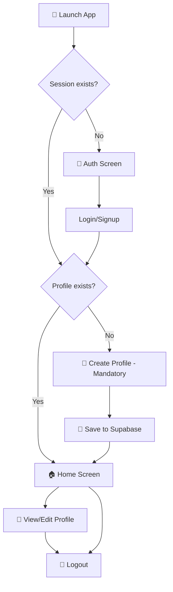

# 📱 Aravind E-Logbook (Phase 1B)

<div align="center">


A modern Flutter application with Supabase backend featuring Google Authentication, session management, and professional profile onboarding.

[Features](#-features) • [Setup](#-supabase-setup) • [Installation](#-installation) • [Usage](#-app-flow)

</div>

---

## ✨ Features

- 🔐 **Google OAuth (PKCE)** + Email/Password authentication via Supabase Auth
- 👤 **Mandatory Profile Capture** after first login with enforced routing
- 💾 **Profile Management** - View and edit profiles stored in Supabase `profiles` table
- 🔄 **Session Restoration** on app restart using Riverpod state management
- 🧭 **Smart Navigation** with GoRouter
- 🌙 **Dark UI** with beautiful Auth, Create Profile, Profile, and Home screens

---

## 🗄️ Supabase Setup

### 1️⃣ Enable Authentication Providers
Navigate to **Authentication → Providers** and enable:
- ✅ Google
- ✅ Email/Password

### 2️⃣ Configure Redirect URLs
Go to **Authentication → URL Configuration** and add:
```
io.supabase.flutter://login-callback
```

### 3️⃣ Apply Database Schema
Run the following SQL in the **SQL Editor**:
```sql
supabase/profile_schema.sql
```

---

## 📱 Mobile Redirect Configuration

### Android 🤖
The intent-filter for `io.supabase.flutter://login-callback` is already configured in:
```
android/app/src/main/AndroidManifest.xml
```
> ⚠️ **Note:** If you change the scheme/host, update `_redirectUrl` in `lib/features/[...]`

### iOS 🍎
The URL scheme `io.supabase.flutter` is already configured in:
```
ios/Runner/Info.plist
```
> ⚠️ **Note:** Keep it in sync with your redirect URL

---

## 🚀 Installation

### Prerequisites
- Flutter SDK (3.35+)
- Dart SDK
- Supabase account

### Setup Steps

1️⃣ **Clone the repository**
```bash
git clone https://github.com/AdiCoder33/AECi.git
cd AECi
```

2️⃣ **Install dependencies**
```bash
flutter pub get
```

3️⃣ **Configure environment**

Create a `.env.local` file in the root directory:
```env
SUPABASE_URL=https://your-project.supabase.co
SUPABASE_ANON_KEY=your-anon-key
```

---

## ▶️ Run

### Option A: Using Environment File (Recommended ⭐)
```bash
flutter run --dart-define-from-file=.env.local
```

### Option B: Inline Defines
```bash
flutter run \
  --dart-define=SUPABASE_URL=https://zivtybyisftechheizwe.supabase.co \
  --dart-define=SUPABASE_ANON_KEY=your-anon-key
```

---

## 🔄 App Flow



### Detailed Flow

1. **🚀 Launch** → Automatically restores Supabase session if present

2. **🔐 Not Logged In** → Auth screen with options:
   - 🔵 Google Sign-In
   - 📧 Email/Password Login
   - ✍️ Email/Password Signup

3. **📝 First Time Login** → Forced Create Profile screen
   - ⛔ Cannot navigate back
   - 💾 Profile data saved to Supabase

4. **✅ Profile Exists** → Home screen displays:
   - 👤 Name
   - 💼 Designation
   - 🏢 Centre
   - 🔗 Navigate to Profile for editing

5. **🚪 Logout** → Available on Home, Profile, and Create Profile screens

---

## 🛠️ Tech Stack

| Technology | Purpose |
|------------|---------|
|  | Cross-platform mobile framework |
|  | Backend as a Service (Auth & Database) |
|  | State Management |
|  | Declarative Routing |

---

## 📂 Project Structure

```
AECi/
├── 📱 android/              # Android platform files
├── 🍎 ios/                  # iOS platform files
├── 📚 lib/
│   ├── 🎨 features/         # Feature modules
│   ├── 🔧 providers/        # Riverpod providers
│   ├── 🧭 router/           # GoRouter configuration
│   └── 🎯 main.dart         # App entry point
├── 🗄️ supabase/
│   └── profile_schema.sql   # Database schema
├── 📄 .env.local            # Environment variables
└── 📖 README.md             # This file
```

---

## 📝 License

This project is part of the Aravind E-Logbook initiative.

---

<div align="center">

**Made with ❤️ using Flutter & Supabase**

[⬆ Back to Top](#-aravind-e-logbook-phase-1b)

</div>